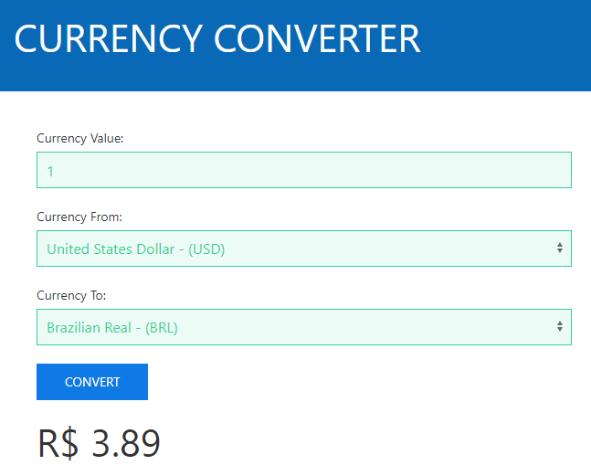

# CurrencyConverter

Example to convert currencies.

## Tools, Practices and Technologies

* Cross-Platform (Windows, Linux, macOS)
* Visual Studio 2017
* .NET Core 2.1.1
* ASP.NET Core 2.1.1
* C# 7.3
* SPA (Single Page Application)
* Angular 7.0.2
* Typescript 3.1.6
* HTML5
* CSS3
* DDD (Domain-Driven Design)
* SOLID Principles
* Unit Tests

## Microservices

**CurrencyList:** List all currencies.

**CurrencyExchange:** Convert from one currency to another.

## Screenshots

